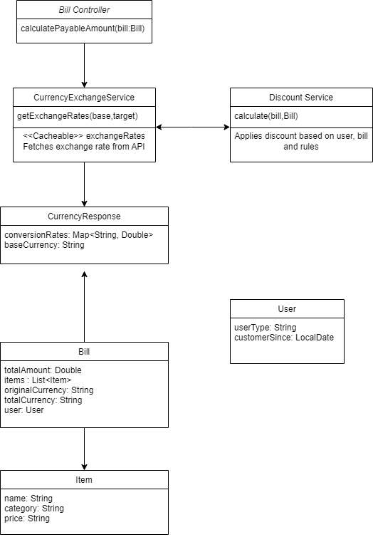

## Description of Key Classes:
1. BillController: This controller class handles HTTP POST requests for the /api/calculate endpoint. It calls the CurrencyExchangeService to fetch the exchange rate and the DiscountService to apply discounts before calculating the final payable amount.
2. CurrencyExchangeService: This service interacts with a third-party currency exchange API to fetch exchange rates. The results are cached using Spring Cache (@Cacheable) to avoid redundant API calls. It uses the CurrencyResponse object to parse the response from the API.
3. DiscountService: This service applies discounts to the bill based on the user type (employee, affiliate, customer for more than 2 years) and the bill details (e.g., items, total amount). It handles both percentage-based and flat discounts.
4. CurrencyResponse: A data model that maps the response from the currency exchange API. It contains a conversionRates map, where the key is the currency code and the value is the exchange rate relative to the base currency.
5. Bill: This model represents a bill, containing a list of items, the total amount, the original currency, the target currency for conversion, and the user information.
6. Item: Represents an item in the bill, including its name, category (grocery or non-grocery), and price.
7. User: This model contains the user’s type (affiliate, employee, or customer) and the tenure (date since the user has been a customer).

## Relationships:
* The BillController interacts with both the CurrencyExchangeService and DiscountService to handle the core logic of calculating the payable amount.
* The Bill class holds references to a list of Item objects and a User object.
* The CurrencyExchangeService interacts with the external API and returns a CurrencyResponse, which holds the exchange rates.
* The DiscountService uses the Bill and User objects to determine the discounts applicable to the bill total.